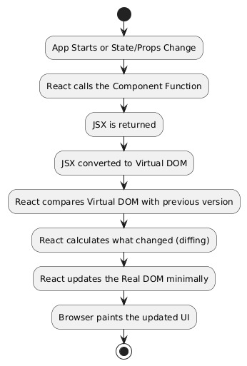

- [x] React BTS

- [ ] States

- [ ] Hooks

- [ ] Folder Structure and Best Practices.

- [ ] Logging props to see attributes?

# Working of React

## React Fiber

React Fiber is an ongoing reimplementation of React's core algorithm.

Its headline feature is **incremental rendering**: the ability to split rendering work into chunks and spread it out over multiple frames.

## Understanding Prerequisites:

#### Components v/s Elements v/s Component Instances

Traditionally , A `Component` will be declared using a `class`  and this class is used to create multiple `instances` each having there own properties and state. -  **Object-Oriented UI Programming**

In this type of Programming , Developer needs to control the Creating and Destroying of the `instances`. Also each `compnent` has to keep an reference of it's `DOM-Node` and `instances` of it's `child-components`

The Problem: *As the no. of possible states grow the lines of code increases*

##### React Elements

An element is a plain object **describing a component instance** or **DOM node** and its desired properties.

React Elements is way to tell React `what you want to see on the screen`.

React Elements are objects and has two fields:

```js
     React Element ={
         type: "String or ReactClass",
         props: object
     }       
```

These are immutable and no methods can be called on them.

**DOM-Elements:** when the `type` of the React Element Object is set to a `string`  it represents a DOM-Node of the represented by that `string`                                                    and  `props` acts attributes to that DOM-Node.

React Elements are lightweight since they are descriptions  in the form of objects.

##### React Components :

A **React Component** is a **function or class** that defines what React Elements should be rendered.

These are the `React Elements Object` whose `type` value is a `function` or a `class`.

In React, components describe any **composable behavior** (ability of an system to rebuild itself using reusable components), and this includes rendering, lifecycle, and state.

###### Class Components v/s Functional Components:

Components defined by Class are know as Class Components.
These are complex yet powerful.

Just like OOP, creates a new instance for every component.

React takes care of creating an instance for every class component.

```js
class Card extends React.Component {
  render() {
    return <div>{this.props.title}</div>;
  }
}
```

**Functional Components:** created by functions.

the functions retuned the required React element Object to render the Component.
Functional Components does not created instances, since they can be used just by calling the function.

Function Components are <mark>simple but not powerful as Class Components.</mark> 

##### React Component Instances:

A **React Component Instance** is the **live, running version** of a React Component in memory. 
It holds:

- **State (via hooks or `this.state`)**

- **Props**

- **Lifecycle data**

- **Effect tracking**

Created when React renders a component.

#### Rendering Components:

To render a Component React ask the Component:
    *What React Element Object it returns for the given props and state*

React will continue this process until it knows all the DOM-Nodes(HTML Tags) required to render the component. This is known as `Renconiliation` 

`Renconiliation` starts when `ReactDOM.render()` or `setState()` is called.

On Successful `reconiliation` , `React` will have Resulting DOM-tree which shall be rendered by `react-dom` and applies changes to necessary updated nodes.

> Why are props immutable?
> 
>    It is very fast to calculate whether the props have changed if they are immutable. Since devs cannot update the value `React` can use previous `props` as reference to calculate changes.

    `React` provides greater optimization by working with immutability.

## Decoding  Reconciliation

`render()` function as creating a tree of React elements. On the next state or props update, that `render()` function will return a different `tree` of React elements.

### Diffing:

Process of identifying differences between two sets of data(generally code or data_structures.)

React uses Diffing to calculate **minimum number of operations required to transform one tree into another.**

Traditional  Algorithms which implements Diffing have a complexity of 

`O(n^3) n: no. of elements`   , if n=1000 then one billion comparisons are needed to construct the new tree

#### React Optimizing Diffing

React employs **two principles/rules** which minimizes the complexity of the algorithm to `O(n)`

1. Two elements of different types will produce different trees.

   

2. The developer can hint at which child elements may be stable(unchanged) across different renders with a `key` prop.       

3. `React`: Handles the Defining New Components and Performing Diffing Algorithm.

   `React-DOM`: Responsible for Starting the Reconciliation Process and Creating and inserting tree. Hence `React-DOM` called **Renderers**

#### Working of React's Diffing Algorithm:

1. React Compares the root elements (Object) , by comparing their `type` field.

2. If the `type`is <mark> not same</mark> React will tear-down the `old-tree` and constructs a `new tree` **form scratch.** 

   > Here `tree` refers to `virtual_DOM`

   1.  While tearing-down a `tree` the `old-nodes` are destroyed( removed from the DOM/UI) with their associated `states`.  This process is known as **Unmounting**  

   2. Note: The Components below the old-nodes will also  be destroyed.

3. If the `type` is same React compares at the attributes and update them without changing the underlying node.

   > [!NOTE]
   >
   > 1. If the element’s **type is the same**, React **doesn’t replace the whole DOM node**, it **updates only what changed** in the element.  
   >

   ```js
   <div className="before" title="stuff" />
   
   <div className="after" title="stuff" />
   ```

   Also , the attribute values are also compared and updates the changed value Eg: `style` attribute

   ```js
   <div style={{color: 'red', fontWeight: 'bold'}} />
   
   <div style={{color: 'green', fontWeight: 'bold'}} />
   ```


        After handling current node then React Recursively compares children  components.

4. Then React will repeats the process on all the components recursively.
   
   **Understanding the flow of recursion:**
   
   React applies the process to all the children and their sub_children before going to the next Node. Consider the below components:
   
   ```jsx
   <Parent>
     <Child-1>
       <SubChild-1 />
     </Child-1>
     <Child-2 />
   </Parent>
   ```
   
   
   
   The React Traverse like `Parent -> Child-1 -> SubChild-1 -> Child-2`
   
   this type of traversal known as depth-first traversal.
   
   `DFS` allows React to create **work on small subtrees independently**, finish them fully, then move to the next sibling.
   
   

5. **Comparing Children's:**
   
   1. React just iterates over both lists of children at the same time and generates a mutation(changes) whenever there’s a difference.
   
   2.  These mutations are generated top-bottom So, inserting an element at the beginning has worse performance. For example, converting between these two trees works poorly:
      
      ```jsx
      //Before
      <ul>
        <li>Duke</li>
        <li>Villanova</li>
      </ul>
      
      //After
      <ul>
        <li>Connecticut</li>
        <li>Duke</li>
        <li>Villanova</li>
      </ul>
      ```

              3.  React will mutate every child instead of realizing it can keep the `<li>Duke</li>` and `<li>Villanova</li>` subtrees intact. This inefficiency can be a problem.

To avoid these problem use **KEYS**:

React supports a `key` attribute. When children have keys, React uses the key to match children in the original tree with children in the subsequent tree.

```jsx
//Before
<ul>
  <li key="2015">Duke</li>
  <li key="2016">Villanova</li>
</ul>


//After
<ul>
  <li key="2014">Connecticut</li>
  <li key="2015">Duke</li>
  <li key="2016">Villanova</li>
</ul>
```

Now React Only makes the change by adding the element with key = 2014

keeping remaining intact.

### Generating Keys for Components:

- Add a new ID property to your props or hash some parts of the content to generate a key.

- <mark> The key only has to be unique among its siblings, not globally unique.</mark>
  
   Don't use indexes as Keys they cause confusion during  comparison 

For example:  if two siblings  components of same type and use indexes as keys

```js
arr = ["Top","Bottom"]

<Sibling-1 Key={0} instance="First"> {arr[0]} </Sibling-1> 
<Sibling-2 Key={1} instance="Second"> {arr[1}</Sibling-2>
```

Suppose a new Element is added at the beginning of the Array, since `keys` are `indexes` all the he `key` values will increase by 1, this violates the whole purpose ha each component should a unique and permanently assigned `key`.

**Tips on Generating Keys:**

- Keys should be stable, predictable, and unique.

- Don't use Math.random() or similar methods these generate Unstable Keys which will cause any component instances and DOM nodes to be unnecessarily recreated -> Degrades the performance.

- Don't use the same `id` as in Database  as `Keys` this will lead to easy injection attacks.

- Use the Encrypted version of `id` in Database of a component as `Key` for a component.

- This will prevent the Hacker from Injection Attack also since we would be having the key to decrypt we could get the `id` for easy debugging. 

- Use `AES` Encryption with secret key stored in `.env` 

### 1. **AES-GCM (Galois/Counter Mode)** — Modern & Safe

✔️ Like AES-CBC but supports **authenticated encryption**. 
✔️ Needs a **nonce (IV equivalent)**, but many systems **embed it into the ciphertext automatically** (e.g., `encrypted + nonce + auth tag` in one string).

✔️ Example (using `crypto` module):

```js
const crypto = require('crypto');
// Function to generate a 256-bit (32 bytes) AES key in hex format
function generateAES256GCMKey() {
    return crypto.randomBytes(32).toString('hex'); // 64 hex chars (32 bytes)
}


function encrypt(text, key) {
    const iv = crypto.randomBytes(12);
    const cipher = crypto.createCipheriv('aes-256-gcm', Buffer.from(key, 'hex'), iv);
    let encrypted = cipher.update(text, 'utf8', 'hex');
    encrypted += cipher.final('hex');
    const tag = cipher.getAuthTag();
    return iv.toString('hex') + ':' + tag.toString('hex') + ':' + encrypted;
}

function decrypt(encData, key) {
    const parts = encData.split(':');
    const iv = Buffer.from(parts[0], 'hex');
    const tag = Buffer.from(parts[1], 'hex');
    const encryptedText = parts[2];
    const decipher = crypto.createDecipheriv('aes-256-gcm', Buffer.from(key, 'hex'), iv);
    decipher.setAuthTag(tag);
    let decrypted = decipher.update(encryptedText, 'hex', 'utf8');
    decrypted += decipher.final('utf8');
    return decrypted;
}
```

✔️ Modern browsers, APIs, and Node.js backend recommend this.


6. For Every Reconciliation process, React Generates a `virtual-DOM` and compares it to the `previous virtual-DOM` and commits the changes/updates to the `Real-DOM`

   

# Debugging in React:

- If you see something wrong on the screen, you can open React DevTools, find the component responsible for rendering, and **then see if the props and state are correct**. If they are, you know that the problem is in the component’s `render()` function, or some function that is called by `render()`. The problem is isolated.

- If the state is wrong, you know that the problem is caused by one of the `setState()` calls in this file. This, too, is relatively simple to locate and fix because usually there are only a few `setState()` calls in a single file.

- If the props are wrong, you can traverse the tree up in the inspector, looking for the component that first “poisoned the well” by passing bad props down

- props and state turn debugging from guesswork into a boring but finite procedure.

- This ability to trace any UI to the data that produced it in the form of current props and state is very important to React. 

## React Fiber

Learn From the PDF:  notes/React Fibre.pdf       
